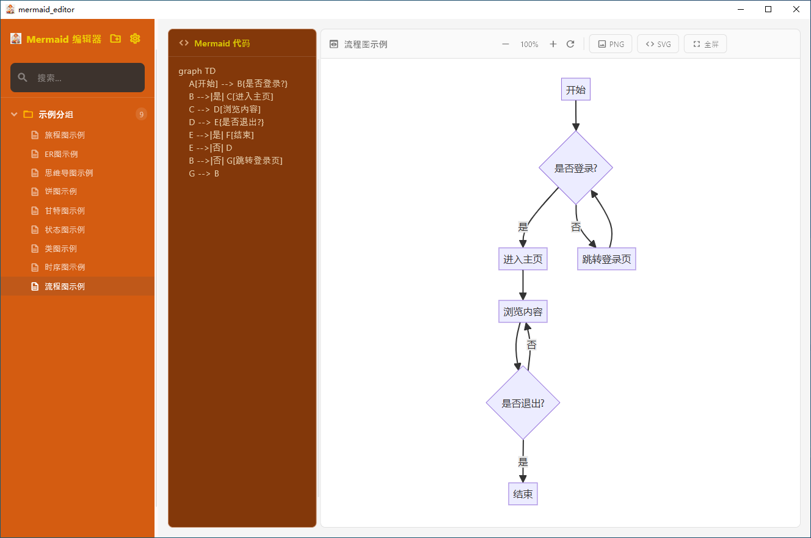
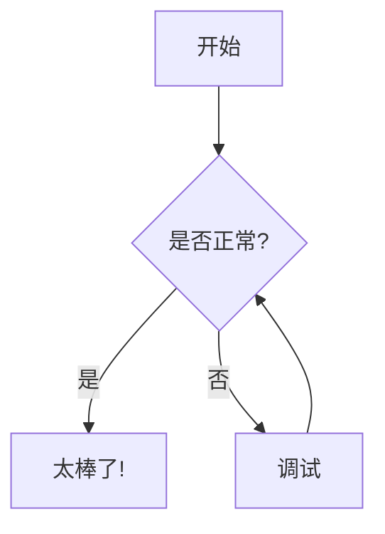

# Mermaid Editor

<p align="center">
  
</p>

<p align="center">
  <strong>🧜‍♀️ 一款精美的跨平台 Mermaid 图表编辑器，基于 Flutter 构建</strong>
</p>

<p align="center">
  <a href="#-功能特性">功能特性</a> •
  <a href="#-截图预览">截图预览</a> •
  <a href="#-安装指南">安装指南</a> •
  <a href="#-使用说明">使用说明</a> •
  <a href="#-构建打包">构建打包</a> •
  <a href="#-参与贡献">参与贡献</a> •
  <a href="#-开源许可">开源许可</a>
</p>

<p align="center">
  
  
  
  
</p>

---

## ✨ 功能特性

- 📝 **实时预览** - 编写代码时即时查看 Mermaid 图表渲染效果
- 📂 **文档管理** - 支持分组管理，轻松组织你的图表文档
- 🎨 **现代界面** - 采用 Material 3 设计语言，支持亮色/暗色主题
- 🖼️ **导出功能** - 支持导出为 PNG 或 SVG 格式
- 🔍 **缩放平移** - 预览区支持缩放和平移操作
- 📺 **全屏模式** - 专注模式，沉浸式查看图表
- ⌨️ **快捷键支持** - 键盘快捷键快速操作
- 💾 **自动保存** - 自动保存文档，再也不怕丢失工作
- 📚 **内置示例** - 包含丰富的图表示例，快速上手 Mermaid 语法

### 支持的图表类型

| 图表类型 | 说明 |
|---------|------|
| 🔀 流程图 (Flowchart) | 流程图和过程流程 |
| 📊 时序图 (Sequence) | 交互时序图 |
| 📐 类图 (Class) | UML 类图 |
| 🔄 状态图 (State) | 状态机图 |
| 📅 甘特图 (Gantt) | 项目时间线图表 |
| 🥧 饼图 (Pie) | 数据可视化饼图 |
| 🧠 思维导图 (Mindmap) | 思维导图 |
| 🗃️ ER 图 (ER Diagram) | 实体关系图 |
| 🚶 旅程图 (Journey) | 用户旅程图 |

## 📸 截图预览

<p align="center">
  
</p>

## 📦 安装指南

### 环境要求

- [Flutter SDK](https://flutter.dev/docs/get-started/install) (3.8.1 或更高版本)
- [Git](https://git-scm.com/)

### 克隆仓库

```bash
git clone https://github.com/Lee0110/mermaid_editor.git
cd mermaid_editor
```

### 安装依赖

```bash
flutter pub get
```

### 运行应用

```bash
# Windows 平台
flutter run -d windows

# macOS 平台
flutter run -d macos
```

## 🚀 使用说明

1. **创建分组** - 点击侧边栏的 "+" 按钮创建新的文档分组
2. **创建文档** - 点击文档图标创建新的 Mermaid 图表
3. **编写代码** - 在左侧代码编辑器中编写 Mermaid 语法
4. **实时预览** - 右侧面板实时渲染图表效果
5. **导出图表** - 点击导出按钮保存为 PNG 或 SVG

### 快捷键

| 快捷键 | 操作 |
|-------|------|
| `Esc` | 退出全屏模式 |
| `↑` / `↓` | 在文档之间切换 |

### Mermaid 代码示例



## 🔨 构建打包

### Windows

```bash
flutter build windows --release
```

可执行文件位于 `build/windows/x64/runner/Release/`

### macOS

```bash
flutter build macos --release
```

应用程序包位于 `build/macos/Build/Products/Release/`

## 🛠️ 技术栈

- **框架**: [Flutter](https://flutter.dev/) 3.8+
- **语言**: [Dart](https://dart.dev/) 3.8+
- **渲染引擎**: [flutter_inappwebview](https://pub.dev/packages/flutter_inappwebview)
- **文件处理**: [file_picker](https://pub.dev/packages/file_picker)、[path_provider](https://pub.dev/packages/path_provider)
- **工具库**: [uuid](https://pub.dev/packages/uuid)

## 🤝 参与贡献

欢迎参与贡献！你可以通过以下方式参与：

1. Fork 本仓库
2. 创建你的功能分支 (`git checkout -b feature/新功能`)
3. 提交你的更改 (`git commit -m '添加某个新功能'`)
4. 推送到分支 (`git push origin feature/新功能`)
5. 发起 Pull Request

### 开发环境设置

```bash
# 克隆你 fork 的仓库
git clone https://github.com/Lee0110/mermaid_editor.git

# 创建分支
git checkout -b feature/你的功能

# 进行修改并运行测试
flutter test

# 提交 PR
```

## 📄 开源许可

本项目采用 MIT 许可证 - 查看 [LICENSE](LICENSE) 文件了解详情。

## 🙏 致谢

- [Mermaid.js](https://mermaid.js.org/) - 强大的图表绘制库
- [Flutter](https://flutter.dev/) - 优秀的跨平台 UI 框架
- 所有贡献者和支持者

---

<p align="center">
  用 ❤️ 和 Flutter 精心打造
</p>
